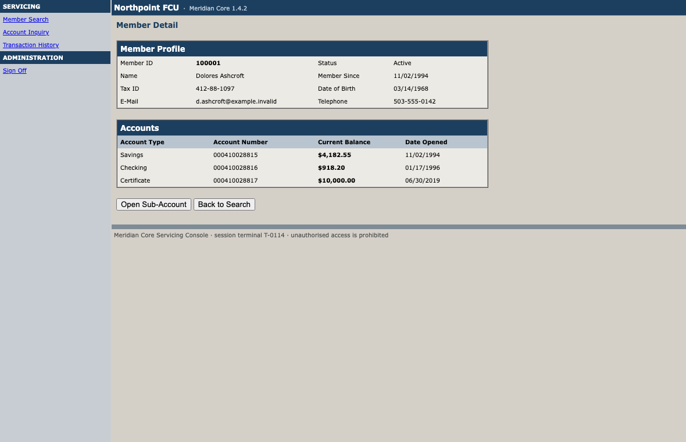
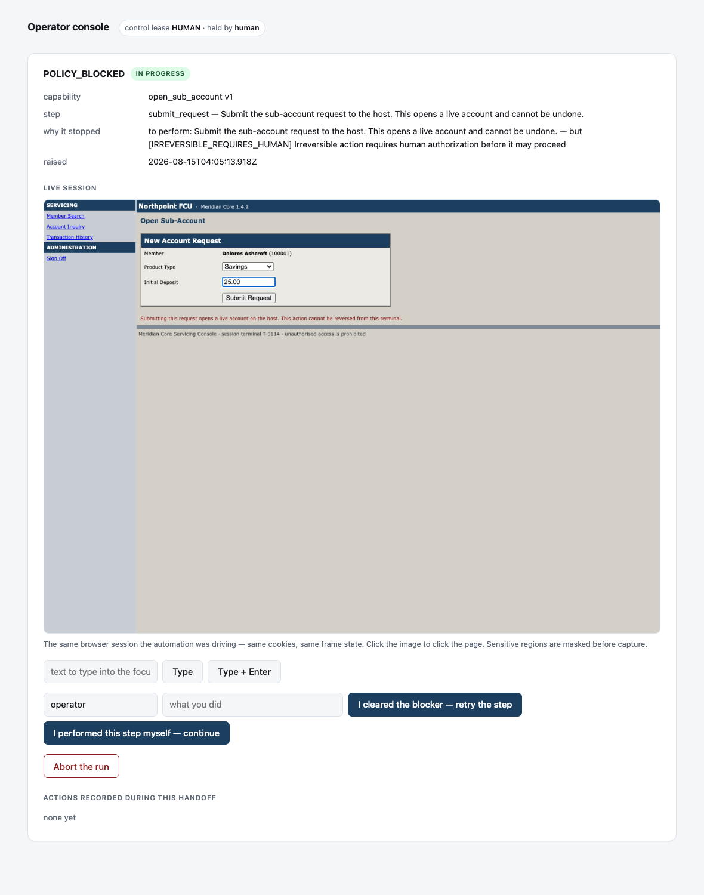

# Computer-Use Automation System

An LLM works out how to complete a task inside a real UI that has no API. The
successful run is recorded as a typed, versioned, reviewable capability. That
capability then replays deterministically, with no model in the loop, and an AI
agent invokes it by name with typed arguments.

The design write-up is in **[REPORT.md](REPORT.md)**. Evidence from real runs is
in **[evidence/](evidence/)**.

---

## Two screens, and why they look nothing alike



**This is the application being automated, and it is ugly on purpose.** It is a
stand-in for the class of software the brief is about — *"legacy web app
(server-rendered, framesets, deeply nested tables, non-semantic markup, no test
IDs)"*. Every hostile property is load-bearing:

| What it looks like | What it forces the system to solve |
|---|---|
| A real `<frameset>` | Frame traversal is mandatory, not optional |
| Table layout, `<font>` tags | No semantic structure to lean on |
| `id="ctl_a1b2_m"`, regenerated every render | ID selectors are worthless |
| No `<label for>` anywhere | Labels must be inferred from the adjacent cell |
| "Member ID" in two different panels | A name-only match is ambiguous by construction |

Make this screen pretty and every problem worth solving disappears with it.



**This is the system's own surface**, and it is the one that should look like a
product. It is what an operator sees when automation stops and asks for a human:
why it stopped, the live session it was driving, and the two distinct ways to
finish — *I cleared the blocker* (retry the step) or *I performed this step
myself* (skip it, so an irreversible action is not done twice).

---

## Setup

Requires Node 20+.

```bash
npm install
npx playwright install chromium
```

Copy the environment template and add an Anthropic API key:

```bash
cp .env.example .env
```

**The key is needed only for `discover` and `agent-demo`.** Deterministic replay
has no model in the loop and works with no key at all — which is the point of
the system, so it is worth verifying: every `replay` command below runs on a
clean checkout with an empty `.env`.

Start the stand-in application (two institutions, one process):

```bash
npm run app
```

- Northpoint FCU → <http://localhost:4173>
- Cascade CU → <http://localhost:4174>
- Sign-on: `teller01` / `demo-password`

Leave it running in its own terminal.

---

## The demo path

### 1. Discover a capability with an LLM *(needs the API key)*

```bash
npm run discover -- --goal "Look up member 100001 and read their current savings balance"
```

Claude drives the live application — signing on, searching, reading the balance
— and emits a capability artifact into `artifacts/`. Drop `--headless` off (the
default) to watch it happen in a real browser window.

The artifact is emitted as a **draft** and will not replay unattended.

### 2. Review and approve

```bash
npx tsx src/cli/index.ts catalog show lookup_member_savings_balance
npx tsx src/cli/index.ts catalog approve lookup_member_savings_balance
```

A single successful run walks exactly one path, so the outcomes the model
declares for the paths it *didn't* walk are hypotheses. Discovery mechanically
rejects the ones that are checkably wrong and flags the rest for a human. See
REPORT §2.

### 3. Replay it deterministically *(no API key, no model)*

```bash
npm run replay -- lookup_member_savings_balance -i memberId=100001
```

```
  lookup_member_savings_balance v1 → SUCCESS
  duration              1450ms
  steps                 5/5 completed
  degraded locators     0

  outputs:
    savingsBalance        4182.55
    memberName            "Dolores Ashcroft"
    memberStatus          "Active"
```

### 4. Error handling and business outcomes

```bash
# A legitimate business answer — not a failure
npm run replay -- lookup_member_savings_balance -i memberId=999999
npm run replay -- lookup_member_savings_balance -i memberId=100002

# Rejected against the declared input contract, before the app is touched
npm run replay -- lookup_member_savings_balance -i memberId=12345

# A recoverable condition: this member raises a native dialog mid-run
npm run replay -- lookup_member_savings_balance -i memberId=100003

# Hard failures, injected into the application on demand
npm run replay -- lookup_member_savings_balance -i memberId=100001 --fault app_error --fault-scope search
npm run replay -- lookup_member_savings_balance -i memberId=100001 --fault session_expired --fault-scope search
```

Exit codes: `0` success, `2` business outcome, `1` failure.

### 5. Human-in-the-loop handoff

`open_sub_account` ends in a step the artifact declares irreversible. Policy
refuses to perform it and escalates.

```bash
# Without an operator, it stops rather than submitting
npm run replay -- open_sub_account -i memberId=100001 -i productType=Savings -i initialDeposit=25.00 --no-operator

# With one: raises an intervention and opens the operator console
npm run replay -- open_sub_account -i memberId=100001 -i productType=Savings -i initialDeposit=25.00
#   → http://localhost:7317/
```

The console shows the live session, lets you take control of it, forwards your
clicks and typing to the same page, and offers two ways to finish: *I cleared
the blocker* (retry the step) or *I performed this step myself* (skip it, so an
irreversible action is not done twice).

To watch the whole cycle without touching a browser:

```bash
./scripts/demo-escalation.sh
```

### 6. Cross-tenant reuse

The same artifact against a second institution running the same vendor product,
with different frame names, different button wording, and an extra login-time
notice — all absorbed by a small overlay:

```bash
npm run replay -- lookup_member_savings_balance -i memberId=100001 --tenant cascade-cu
```

### 7. An AI agent invoking the capability *(needs the API key)*

```bash
npm run agent-demo -- "I'm a teller at the branch. Please look up the savings balance for member 100001, and also check member 999999."
```

The agent is given the catalog as tools, chooses one, and calls it. Everything
after that is deterministic.

```
  ▸ agent invokes capability "lookup_member_savings_balance" with {"memberId":"100001"}
  ◂ {"status":"success","outputs":{"savingsBalance":4182.55,...}}
  ▸ agent invokes capability "lookup_member_savings_balance" with {"memberId":"999999"}
  ◂ {"status":"outcome","outcome":"MEMBER_NOT_FOUND",...}
```

---

### 8. Surviving a change to the application

The claim the whole design rests on is that a capability recorded once keeps
working. So test it: apply a vendor point release and replay the *same,
already-committed artifact*.

```bash
./scripts/demo-drift.sh
```

It reworders the search button, re-orders the accounts table columns, inserts a
new column, and wraps every cell in a `<span>` — then replays without
re-recording anything.

```
before   degraded locators 0    savingsBalance 4182.55
after    degraded locators 1    savingsBalance 4182.55

  tier 2 via label       cell "$4,182.55" in the Accounts panel
  tier 5 via structural  button "Search" in the Member Search panel   <<< DEGRADED
        tried role_name  → 0 match(es)
```

Two different things happened, and both matter. The balance still resolved at
**tier 2**, addressed as *"the Savings row, Current Balance column"* — the column
physically moved and it did not matter. A positional selector would now be
reading the newly-inserted **Status** column and reporting `"Open"` as a balance.

The reworded button could not survive on name, so it dropped to the structural
tier and was **flagged**. Nothing failed. But the capability is now one change
away from failing, and we know before a caller does.

```bash
# The same signal, aggregated over repeated runs — exit 0 healthy, 2 degraded, 1 blocked
npm run stability -- lookup_member_savings_balance -i memberId=100001 -n 5
```

### 9. Proof it isn't overfitted to my own markup *(needs the API key)*

Everything above runs against an application I wrote. This runs against one I
didn't — [saucedemo.com](https://www.saucedemo.com), published by Sauce Labs as
an automation target, with the dummy credentials printed on its own login page:

```bash
CUA_OPERATOR_ID=standard_user CUA_OPERATOR_PASSWORD=secret_sauce \
  npm run discover -- --goal "Add the Sauce Labs Backpack to the cart and reach the checkout overview page" \
  --target https://www.saucedemo.com/ --vendor saucelabs --product swag-labs \
  --capability-id add_backpack_to_cart --headless

npx tsx src/cli/index.ts catalog approve add_backpack_to_cart

CUA_OPERATOR_ID=standard_user CUA_OPERATOR_PASSWORD=secret_sauce \
  npm run replay -- add_backpack_to_cart -i firstName=Ada -i lastName=Lovelace -i postalCode=94107 \
  --base-url https://www.saucedemo.com --headless
```

Two things to notice. Every step there resolves at **tier 0 (`test_id`)**,
because Sauce Labs ships `data-test` attributes — while the legacy console has
none and resolves at tier 2. And the model stopped short of clicking *Finish* on
its own, because submitting the order is irreversible.

---

## Tests

```bash
npm test          # 75 tests
npm run typecheck
```

Covering the load-bearing logic: locator resolution against real markup in a
real browser, redaction, the policy model, the control-lease state machine,
input binding and output coercion, artifact schema, and tenant-overlay merging.

---

## Regenerating the evidence

```bash
./scripts/make-evidence.sh
```

Runs every scenario against the live application and refreshes `evidence/`.
The discovery bundle is preserved as-is (it costs money to produce).

---

## Layout

```
src/
  surface/      SurfaceDriver interface + Playwright web implementation
  perception/   DOM/AX traversal → normalized element model; locator synthesis
  artifact/     Zod schema, persistence, tenant-overlay merge
  discovery/    LLM agent loop, prompt, step recorder, post-run validation
  replay/       Deterministic executor, conditions, result contract
  policy/       Allowlist, action-risk classification, redaction
  escalation/   Control lease, operator console, human-action capture
  evidence/     Structured run logging
  catalog/      Agent-facing tool definitions
  cli/          discover · replay · catalog · agent-demo
target-app/     The stand-in legacy servicing console (two tenants)
artifacts/      Saved capabilities and tenant overlays
evidence/       Committed run bundles
```

---

## The stand-in application

There is no real bank system here and no attempt to obtain one. `target-app/` is
a deliberately hostile stand-in for the class of software this exists to
automate: a real `<frameset>`, table-based layout, `<font>` tags, element ids
regenerated on every render, no test ids, no ARIA, form fields whose only label
is the adjacent table cell, and the same label text in two different panels.

It can also be told to produce each runtime failure the brief names — validation
error, record not found, permission denial, unexpected dialog, session expiry,
transient slowness, application error — on demand, one request at a time:

```bash
curl -X POST http://localhost:4173/_admin/faults \
  -H 'content-type: application/json' -d '{"kind":"app_error","scope":"search"}'
```

That is what makes the error-handling evidence reproducible rather than
something you have to take on faith. REPORT §1 explains why the target is
self-built.

All fixture data is invented. The tax IDs and dates of birth are format-valid
and fictitious, and they exist so the redaction layer has something real to
catch — a demo where no sensitive data ever appears on screen does not
demonstrate that sensitive data is handled.
